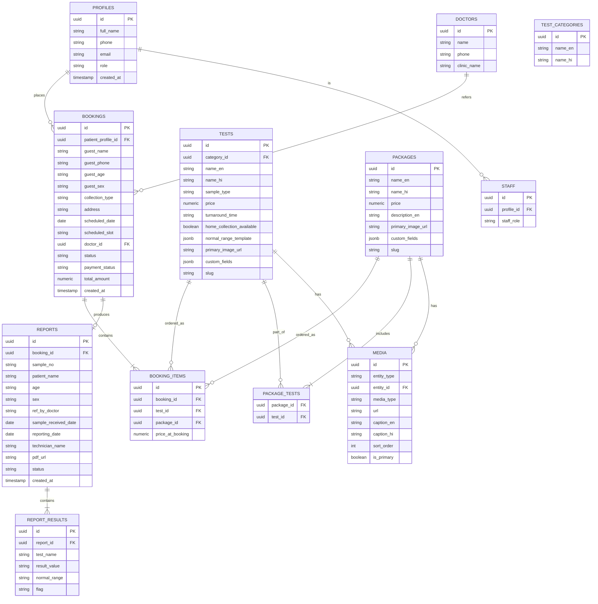

# Pokaran Lab — Web App System Design & Build Plan

**Business:** Pokaran Diagnostic & Dr X Ray Center ("Pokaran Lab" as the web brand)
**Location:** Near CHC / Govt. Hospital, Jodh Nagar, Pokaran, Dist. Jaisalmer, Rajasthan
**Domain:** pokaranlab.com (to register)
**Budget:** ~₹500–1000/month ongoing
**Timeline:** No rush — build it properly
**Builders:** You + Claude, pairing

> This is the original planning document, kept verbatim as the source of intent. Where the
> actual build has diverged (framework versions, deferred scope, etc.), see
> [decisions-log.md](./decisions-log.md) — don't edit this file to match reality, edit the log.

---

## 1. What this document covers

1. Final tech stack + reasoning
2. High-level design (HLD)
3. Low-level design (LLD) — module by module
4. Database schema
5. Frontend system design (incl. bilingual + SEO structure)
6. Admin app design
7. Report generation spec (matched to the lab's actual report format)
8. Notifications plan (MVP-appropriate)
9. Hosting & cost breakdown
10. GEO/SEO execution plan (the "rank #1 in Pokaran" part)
11. Phased build roadmap
12. What we build first

---

## 2. Tech stack (final)

| Layer | Choice | Why |
|---|---|---|
| Frontend framework | **Next.js 14+ (App Router)** | SSR/SSG so pages are crawlable HTML on first load — critical for the ranking goal. Same React you already know. |
| Styling | **Tailwind CSS** | Fast to build, small bundle, easy to keep consistent between public site and admin. |
| Backend / DB | **Supabase (Postgres)** | Relational data fits bookings/tests/reports naturally. Bundled Auth + Storage + Row Level Security. Free tier covers MVP scale. |
| Hosting (frontend) | **Vercel (Hobby/free tier)** | Built for Next.js, free SSL, global CDN, zero-config deploys from GitHub. |
| Hosting (backend) | **Supabase Cloud (free tier → Pro later)** | No server to manage. |
| i18n | **next-intl** | Clean Hindi/English routing (`/en/...`, `/hi/...`) with shared components. |
| PDF generation | **@react-pdf/renderer** (server-side) | Generates the report PDF in the exact layout of the lab's existing letterhead. |
| SMS | **Msg91 or Fast2SMS** (pay-per-SMS, Indian gateways) | Cheap (₹0.15–0.25/SMS), no monthly fee, good for booking confirmations. |
| WhatsApp (MVP) | **`wa.me` click-to-chat links** | Zero cost, zero approval process. Full WhatsApp Business API comes in Phase 5. |
| Domain/DNS | **Namecheap or Hostinger** | Cheapest reliable `.com` registration + free DNS. |
| Analytics | **Google Search Console + Google Analytics (free)** | Needed to actually measure the SEO/GEO progress. |
| Version control | **GitHub (free, private repo)** | Needed for Vercel's git-based deploys anyway. |
| Images | **Supabase Storage (`public-media` bucket) + `next/image`** | Free tier storage for catalog/landing photos; `next/image` auto-optimizes size/format per device — matters for both page speed (SEO) and mobile data usage in Pokaran. |
| Video | **YouTube (unlisted or public) embeds** | Zero storage/bandwidth cost. Raw video files would burn through Supabase's free storage quickly — never worth self-hosting video at this budget. |
| Maps | **Google Maps Embed (free iframe, no API key needed for basic embed)** | Live, pinned map + one-tap "Get Directions" — no billing setup required at this scale. |

**Why not plain React / CRA:** no SSR means blank HTML for crawlers — directly works against your main goal.
**Why not a custom Node backend:** Supabase gives you 80% of what you'd hand-build (auth, file storage, RLS) for free, at MVP scale.
**Why not WordPress:** faster to make *a* website, but weaker for a real booking system + admin workflow, and you already have React skills that Next.js leverages directly.

---

## 3. High-level design (HLD)

Walkthrough of the two flows that matter most:

**Booking flow:**
Patient (browser) → Next.js public pages (test catalog, booking form) → Server Action writes to Supabase Postgres (`bookings` + `booking_items`) → Server Action calls SMS API → confirmation SMS sent → booking appears in admin dashboard (reads from same Postgres table).

**Report flow:**
Staff (browser, admin panel) → fills report form → Server Action writes to `reports` + `report_results` tables → generates PDF via `@react-pdf/renderer` → PDF uploaded to Supabase Storage → patient retrieves via phone number + sample number lookup (no forced account) → downloads PDF from Storage.

**SEO/GEO flow:**
Next.js renders full HTML per test/condition page at build or request time → Google/Bing/AI crawlers index it → structured data (JSON-LD) tells them exactly what the page is about → this is what eventually surfaces in Google's local pack and in LLM answers.

---

## 4. Low-level design (LLD) — modules

### 4.1 Catalog module
- Public: browse tests/packages, search by name or health concern, view price + sample type + prep instructions.
- Admin: full CRUD on tests, packages, categories, prices. This is intentionally simple — your friend or staff should be able to add "Vitamin D3 Test — ₹800" in under a minute.

### 4.2 Booking module
- Public: select test(s)/package(s) → choose walk-in or home collection → (if home) enter address + slot → enter name/phone/age/sex → optional referring doctor → submit (guest checkout, no forced login).
- System: creates a `pending` booking, sends SMS confirmation, notifies admin dashboard.
- Admin: view/filter bookings by date/status, update status (confirmed → sample collected → processing → report ready), assign to staff.

### 4.3 Auth module
- Two identity types: **staff/admin** (real login, Supabase Auth email+password) and **patients** (no forced signup — identified by phone number + OTP only when they want to view booking history or reports).
- Row Level Security: staff/admin role sees everything; a patient session can only read rows matching their own phone number.

### 4.4 Report module
- Admin fills a structured form matching the lab's real report layout (see Section 7).
- On save: generates PDF, stores in Supabase Storage, links to the booking.
- Public: "Download Report" → enter phone number + sample number (or OTP-verified phone) → see matching reports → download PDF. This mirrors how Dr Lal PathLabs' own guest download flow works, and matters more here because most patients in Pokaran won't want to create an account.

### 4.5 Notification module
- MVP: transactional SMS on (a) booking confirmed, (b) report ready. Triggered from Server Actions via the SMS gateway API.
- `wa.me` links throughout the site ("Book on WhatsApp", "Ask a question") route to the lab's WhatsApp number with a pre-filled message — no API needed.
- Phase 2+: WhatsApp Cloud API (Meta) for automated two-way confirmations once volume justifies the setup effort.

### 4.6 Admin module
See Section 6.

---

## 5. Database design



**Row Level Security (RLS) — the important bit:**
- `tests`, `packages`, `test_categories` — public read, staff/admin write.
- `bookings`, `booking_items` — patient can only read rows where phone matches their verified session; staff/admin read/write all.
- `reports`, `report_results` — same pattern as bookings.
- `staff` — admin-only read/write.
- `media` — public read (catalog/landing images must be visible without login); staff/admin write.

This is enforced *at the database level* via Supabase policies, not just in the frontend — meaning even a bug in your UI code can't leak another patient's report.

### 5.1 Media & storage design

**Two Supabase Storage buckets:**

| Bucket | Access | Contents |
|---|---|---|
| `public-media` | Public read | Test/package images, landing page hero images, lab gallery photos, logo |
| `reports` | Private (RLS + signed URLs only) | Patient report PDFs — never publicly listable |

**Why a separate `media` table instead of just an `image_url` column:**
`primary_image_url` on `tests`/`packages` covers the single thumbnail shown in catalog grids (fast, no extra join). The `media` table handles everything else — multiple photos per test, landing-page carousel images, lab gallery, and video links — all through one flexible structure (`entity_type` + `entity_id` says what the media belongs to: a specific test, a package, or `'landing'` for site-wide content that isn't tied to any single product).

**Custom fields (`custom_fields jsonb`):**
Rather than hardcoding columns for every possible attribute, `tests` and `packages` get a flexible `jsonb` field your friend's admin panel can edit as simple key/value pairs — no developer needed to add a new attribute later. Examples:
```json
{
  "fasting_required": "8–10 hours",
  "sample_type_detail": "5ml venous blood",
  "report_delivery": "Same day by 6 PM",
  "home_collection_charge": "₹50"
}
```

**Practical note on images at scale:** with 700+ tests (matching Dr Lal PathLabs' range), don't expect a unique photo per test — that's unrealistic to shoot/source. Use a small set of **category-level default images** (one per `test_category` — e.g. a generic "blood test" vial photo, an X-ray photo, an ECG photo) that every test in that category falls back to, with `primary_image_url` left empty. Your friend can override with a specific photo only for the tests/packages that matter most commercially (health checkup packages, popular tests) — that's a much more realistic admin workload than photographing 700 individual tests.

---

## 6. Frontend system design

**Routing (Next.js App Router, locale-prefixed):**
```
/[locale]/                      → landing page
/[locale]/tests                 → full test menu (filterable)
/[locale]/tests/[slug]           → individual test SEO page (e.g. /en/tests/cbc-test-pokaran)
/[locale]/packages/[slug]        → package SEO page
/[locale]/book-a-test            → booking flow
/[locale]/download-report        → phone + sample no. lookup
/[locale]/find-us                → address, map embed, contact, hours
/[locale]/about                  → trust content: experience, equipment, doctor
/admin/*                         → staff/owner only, not locale-prefixed
```

**Bilingual approach:** every content table has `_en` / `_hi` columns (see schema); `next-intl` handles UI strings; a simple language toggle persists via cookie. Hindi content isn't a translation afterthought — write the Hindi test/condition pages natively, since that's what most Pokaran residents will actually search in.

**SEO structure per page:**
- Unique `<title>` and meta description per test/condition/package page (not one generic template).
- JSON-LD structured data: `MedicalOrganization` + `LocalBusiness` on every page (name, address, phone, hours, geo-coordinates), `MedicalTest` schema on test pages.
- `sitemap.xml` auto-generated from the tests/packages tables.
- `robots.txt` allowing full crawl.
- Fast Core Web Vitals — Next.js + Vercel gets you most of this for free, but keep images optimized (`next/image`) and avoid heavy client JS on landing pages.

**Component architecture:** shared design-system components (Button, Card, Badge, FormField) used by both public site and admin — this is where reusing your React experience pays off directly.

### 6.1 Landing page media

| Section | Content | Source |
|---|---|---|
| Hero | Rotating carousel, 3–5 images (exterior signage, interior, equipment) with bilingual caption overlay | `media` table, `entity_type='landing'` |
| Services | Blood test / X-ray / ECG / home collection, each with an icon-style photo | `media` or category defaults |
| Popular tests grid | Test cards using `primary_image_url` (falls back to category default) | `tests.primary_image_url` |
| Lab gallery / "Why choose us" | 6–8 photo carousel — equipment, staff, waiting area, sample collection in progress | `media` table |
| Location | Live Google Maps embed pinned to the exact address, "Get Directions" button (opens Google Maps app/site), address text in Hindi and English | Static embed, no API key needed |
| Optional lab tour video | Short YouTube embed, captioned in both languages | `media` table, `media_type='video'` |

The Google Maps embed matters more than it might seem: it's a trust signal for first-time visitors *and* it reinforces the exact same NAP (name/address/phone) data that's in your Google Business Profile and JSON-LD schema — consistency across all of these is a real ranking factor (see Section 11).

### 6.2 Modern UI direction (starting point, not final)

Rather than a generic "clean medical SaaS" template, ground the visual identity in the actual place — Jaisalmer district's sandstone forts and Rajasthani textile heritage — balanced against the clinical trust a diagnostics brand needs:

- **Palette:** sandstone gold `#C9A063` (accent, evoking the golden fort), deep indigo `#1B2A4A` (primary dark — Rajasthani indigo dye tradition, doubles as a serious/trustworthy tone), clinical teal `#0F6E56` (medical trust, status/success states), warm paper `#FAF7F1` (background, not stark clinical white), ink `#2C2C2A` (text).
- **Type:** **Hind** (Ek Type) as the primary typeface for body text and all Hindi content — it's built for Devanagari and Latin together, so English and Hindi actually feel like one coherent system instead of Hindi being a bolted-on afterthought. A single distinctive display serif (e.g. **Fraunces**) used sparingly for English hero headlines only, for a touch of heritage/trust without fighting legibility.
- **Signature element:** a "sample journey" motif — a dotted route line (visually nodding to historic desert trade routes through Pokaran) connecting four waypoints: Book → Collect → Test → Report. This doubles as an actual navigation aid for the booking flow, not just decoration.
- This is a starting direction, not a locked decision — we'll refine it once we're actually building screens, per the design-system approach (token system first, build second).

---

## 7. Admin app design

Same Next.js app, `/admin` routes, gated by Supabase Auth + role check. Two access tiers:

| Role | Access |
|---|---|
| **Owner (your friend)** | Everything: bookings, reports, catalog, staff accounts, revenue view |
| **Staff (technician/receptionist)** | Bookings list, report entry, catalog view (no pricing edit unless granted) |

**Screens:**
1. **Dashboard** — today's bookings, pending reports, quick stats (bookings/day, revenue — owner only)
2. **Bookings** — list/filter by date & status, update status, view patient contact
3. **Report entry** — this is the one that matters most. Built to mirror your friend's actual paper report:
   - Sample No. (auto-suggested, editable)
   - Patient Name, Age, Sex
   - Ref. By (doctor — autocomplete from `doctors` table, or free text)
   - Sample Received Date / Reporting Date
   - Test results — add rows by selecting from the test catalog (auto-fills normal range), enter result value, system flags High/Low automatically against the stored `normal_range_template`
   - Technician name
   - "Not valid for medico-legal cases" disclaimer — included by default, matching current practice
   - On save → generates PDF → patient can retrieve it
4. **Catalog management** — add/edit tests, packages, prices, categories; drag-and-drop image upload (multiple photos, reorder, set primary); free-form custom fields editor (add "fasting required", "home collection charge", etc. without a developer)
5. **Site content** — owner-editable landing page: hero carousel images, gallery photos, video links, opening hours — so updating the homepage doesn't require touching code
6. **Staff management** — owner only, add/remove staff logins

Design principle: **mobile-first, minimal taps.** Staff will likely use this on a phone between patients, not a desktop.

---

## 8. Report generation spec

Matched directly to the lab's current letterhead format from your photo, so the digital report looks familiar to referring doctors and patients:

- Header: "Pokaran Diagnostic & Dr X Ray Center" + address + phone numbers
- Sample No. / Sample Received Date / Reporting Date
- Patient Name / Ref. By / Age / Sex
- Test section header (e.g. "Haemogram complete")
- Table: Test | Result | Normal Value
- Technician signature line
- Footer: "All type of blood investigation | Digital X-ray | E.C.G." + contact numbers + disclaimer

PDF is generated server-side and stored privately in Supabase Storage; a signed, time-limited URL is what the patient actually downloads (so old reports can't be scraped in bulk from outside).

---

## 9. Notifications (MVP scope — deliberately minimal)

| Trigger | Channel | Cost |
|---|---|---|
| Booking confirmed | SMS | ~₹0.20/SMS |
| Report ready | SMS | ~₹0.20/SMS |
| "Book on WhatsApp" | `wa.me` link (manual reply) | Free |
| Automated WhatsApp confirmations | **Deferred to Phase 5** | Requires Meta Business verification — not worth the setup cost at MVP stage |

At an estimate of ~10–20 bookings/day, that's roughly ₹60–120/month in SMS — comfortably inside your budget.

---

## 10. Hosting & cost breakdown

| Item | Provider | Cost |
|---|---|---|
| Domain (pokaranlab.com) | Namecheap/Hostinger | ~₹900–1,200/year (~₹75–100/mo amortized) |
| Frontend hosting | Vercel Hobby | ₹0 (free tier is generous enough for this traffic) |
| Database + Auth + Storage | Supabase Free tier | ₹0 (500MB DB, 1GB storage, 50K monthly active users — well above what a single-branch lab needs at launch) |
| SMS | Msg91/Fast2SMS pay-as-you-go | ~₹60–120/month at ~15 bookings/day |
| Email (info@pokaranlab.com) | Zoho Mail Free | ₹0 |
| SSL | Included via Vercel | ₹0 |
| **Total realistic monthly cost** | | **~₹150–200/month** |

That leaves real headroom under your ₹500–1000 ceiling — useful once you outgrow Supabase's free tier (Pro is $25/mo ≈ ₹2,100, but that's a "you're now doing serious volume" problem, not a launch problem) or want paid SEO/local-listing tools later.

---

## 11. GEO/SEO execution plan — the "rank #1 in Pokaran" part

This is 70% off-site work, 30% the app itself. Competition check: the existing pathology listings around Pokaran on Justdial have only 2–10 reviews each and no real websites — the bar is low if this is done properly and consistently.

**Foundational (do first, before/alongside build):**
1. Claim and fully complete the **Google Business Profile** — category (Diagnostic Center / Medical Lab), hours, services list, photos of the actual lab, phone number matching the site exactly.
2. **NAP consistency** — same exact Name/Address/Phone on the website, Google Business Profile, Justdial, Facebook. Any mismatch actively hurts local ranking.
3. Register on **Justdial, Practo, IndiaMART (health)** — free listings, more citations = more trust signal.

**On the site:**
4. `LocalBusiness` + `MedicalOrganization` JSON-LD schema on every page (name, address, geo-coordinates, phone, opening hours).
5. Individual landing pages per test and per health concern (CBC, thyroid, X-ray, ECG, fever panel, etc.) in both Hindi and English — this is exactly the kind of specific, well-structured content that gets pulled into AI answers.
6. A clear, factual "About" page — years running, equipment, services — written so an AI system reading it can extract clean facts, not marketing fluff.

**Ongoing:**
7. **Reviews** — ask every satisfied patient for a Google review after their visit (a simple SMS with a review link works). Real, steady reviews are one of the strongest signals for both Google's local pack and AI-answer citations.
8. Submit the sitemap to **Google Search Console**, monitor which queries the site is showing up for.
9. Track AI visibility manually — periodically ask ChatGPT/Gemini/Perplexity "diagnostic lab in Pokaran" and see if you're mentioned; adjust content based on what's missing.

This is a multi-month process, not a launch-day switch — but for a town the size of Pokaran, consistent execution on the above will very plausibly get you to the top, because almost nobody else is doing it properly.

---

## 12. Phased build roadmap

| Phase | Scope |
|---|---|
| **0 — Setup** | Register domain, create GitHub repo, Supabase project, Vercel project, claim Google Business Profile |
| **1 — Core MVP** | Landing page, test/package catalog, booking flow (walk-in + home collection), basic admin (bookings + catalog CRUD) |
| **2 — Reports** | Report entry form, PDF generation, patient lookup/download flow |
| **3 — SEO buildout** | Per-test/condition landing pages (EN + HI), schema markup, sitemap |
| **4 — GEO/local authority** | Reviews process, citations, Search Console, content expansion |
| **5 — Growth** | Online payments (UPI), WhatsApp Business API, staff roles/permissions, analytics dashboard |

You told me: MVP scope first (Phase 1 + payment infra scaffolded but not wired). That's the right call — get something real in your friend's hands, then layer on reports and SEO content.

---

## 13. What we build first

Recommended starting point: **Phase 0 + the skeleton of Phase 1** — repo setup, Supabase schema (Section 5), and the landing page + test catalog + booking form. That gives your friend something visible and usable fastest, and everything else builds on top of it cleanly.
